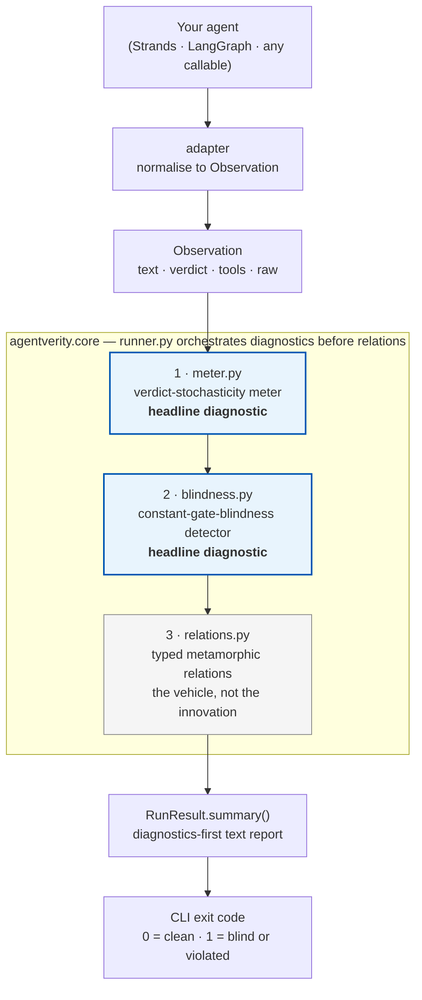

# agentverity

> **Does your agent test suite actually test anything, or is it lying to you?**

[](https://www.python.org/downloads/)
[](https://github.com/mrwersa/agentverity/actions/workflows/ci.yml)
[](https://github.com/mrwersa/agentverity/blob/main/LICENSE)
[](#tests)
[](#status)

**agentverity** is a measure-first testing framework for non-deterministic LLM agents. Before running any test relation, it answers two questions that ordinary pass-rate reports leave unresolved:

1. **Is the agent's verdict stable enough to test against?** (verdict-stochasticity meter)
2. **Is the test suite trivially satisfied by an indifferent agent?** (constant-gate-blindness detector)

The meter recommends an oracle. The skew scan warns when green relation
results may be vacuous. Neither substitutes for a correctness specification.

---

## Why does this exist?

Testing LLM agents is hard because they are non-deterministic: the same input can produce different outputs on different runs. Existing frameworks handle this by running the agent N times and reporting pass rates with confidence intervals. That is necessary but not sufficient. It misses two failure modes:

**Failure mode 1: the verdict is stable but you are using noise-tolerant tests.** If the agent's categorical decision (allow/block, safe/unsafe, tool A/tool B) never flips across reruns and a trusted reference is available, frozen-baseline diffing is the more sensitive change detector. Metamorphic violations are a subset of the verdict changes that diffing can expose. Relations still express useful requirements when no reference exists.

**Failure mode 2: the agent is near-constant and your suite may pass vacuously.** If the agent returns the same verdict on 96% of a diverse input set, many relations can hold without exercising a decision boundary. That pass says little about whether the agent reasons correctly.

agentverity detects both failure modes *before* running any test relation, and tells you which oracle to use.

---

## How is this different from existing tools?

| | [DeepEval](https://github.com/confident-ai/deepeval) | [promptfoo](https://github.com/promptfoo/promptfoo) | [CheckList](https://github.com/marcotcr/checklist) | [AgentAssay](https://arxiv.org/abs/2603.02601) | [agentrial](https://github.com/alepot55/agentrial) | **agentverity** |
|---|---|---|---|---|---|---|
| Repeated trials | Yes | Yes | No | Yes | Yes | **Yes** |
| Uncertainty or calibration | Repeat scores | Repeat scores | No | Trial calibration | Wilson pass-rate CIs | **Wilson CI over disjoint verdict pairs** |
| Verdict-layer oracle choice | No | No | No | No | No | **Yes** |
| Probe-set skew warning | No | No | No | No | No | **Yes** |
| Metamorphic relations | No | No | INV/DIR (owns it) | Yes | No | Yes (inherited) |
| License | Apache-2.0 | MIT | MIT | AGPL | MIT | **Apache-2.0** |

**What we borrowed (and from where):**
- Metamorphic relations from [Chen et al. (1998)](https://arxiv.org/abs/2002.12543) and the [CheckList](https://aclanthology.org/2020.acl-main.442/)/[LLMORPH](https://github.com/steven-b-cho/llmorph) tradition — the escape from the oracle problem for non-deterministic systems.
- Semantic-invariance transforms (normalisation, casing, whitespace) from [CheckList](https://github.com/marcotcr/checklist).
- [Wilson confidence intervals](https://en.wikipedia.org/wiki/Binomial_proportion_confidence_interval#Wilson_score_interval) from [AgentAssay](https://arxiv.org/abs/2603.02601) and [agentrial](https://github.com/alepot55/agentrial) — but we use them for a different purpose: certifying verdict stability across reruns, not pass-rate CIs.

**The narrow gap agentverity fills:**

1. **Verdict-layer oracle selection.** Existing tools can repeat cases, estimate pass rates, and mutate suites. agentverity asks a different question first: is the categorical decision stable enough that a frozen baseline is stronger than a metamorphic relation? The answer is tri-state rather than guessed from a few identical runs.

2. **Constant-gate-blindness detector.** A gate that returns `"allow"` on 96% of a probe set can satisfy many invariance relations without exercising a boundary. agentverity measures that skew and flags the green report as potentially vacuous.

3. **Diagnostics before relations.** The primary output is not another pass rate. It is an oracle recommendation and a warning about whether the probe set can make the agent change its mind. Relation results come afterwards.

Metamorphic relations are the vehicle. The diagnostics are the product.

---

## Quickstart

### Install

Install from source. The package is not on PyPI yet, so install from the
repository:

```bash
pip install git+https://github.com/mrwersa/agentverity.git
```

For Strands agent support:

```bash
pip install "agentverity[strands] @ git+https://github.com/mrwersa/agentverity.git"
```

### Use in Python

```python
from agentverity import run, from_callable

def my_gate(text: str) -> dict:
    verdict = "block" if "secret" in text.lower() else "allow"
    return {"text": f"decision: {verdict}", "verdict": verdict}

agent = from_callable(my_gate)
result = run(agent, inputs=["hello", "a secret", "world", "foo"])
print(result.summary())
```

Output (captured from an actual run, not hand-written):

```
============================================================
agentverity — suite-quality report
============================================================

1. VERDICT-STOCHASTICITY METER
   call:        undecided (add repeats or inputs)
   flip rate:   0.0% (0/8 pairs)
   Wilson CI:   [0.000, 0.324] at epsilon=0.01
   inputs:      4, repeats: 5, layer: verdict
   advice:      not enough evidence to choose an oracle; raise K or input count.

2. CONSTANT-GATE-BLINDNESS DETECTOR
   call:        ok
   skew:        75.0% ('allow' on 4 inputs)
   distinct:    2 verdicts

3. ORACLE GUIDANCE
   UNDECIDED — raise k or input count before choosing an oracle.

4. RELATION RESULTS
   relation                       type           held   violated  skipped     rate
   ------------------------------ ------------ ------ ---------- -------- --------
   normalisation-invariance       invariant         0          0        4      n/a
   case-invariance                invariant         4          0        0     0.0%
   whitespace-invariance          invariant         4          0        0     0.0%
   tool-selection-invariance      invariant         0          0        4      n/a

   NOT EXERCISED: normalisation-invariance, tool-selection-invariance.
   The transform returned every input unchanged, so the agent was never
   asked a different question. Rows marked n/a are not evidence of
   anything. Add inputs the transform actually changes.
```

Two things in that report are the whole point of the library.

The meter says `undecided`, not `verdict-deterministic`, even though `my_gate` is a plain Python function with zero randomness. Four inputs at five repeats yield eight independent, disjoint comparisons. That is nowhere near enough to certify a flip rate below the strict default epsilon of 1%. The meter exposes that cost instead of manufacturing certainty. Raise `k`, add inputs, or choose a deployment-relevant epsilon before making a deterministic call.

Two relations report `n/a` rather than a green `0.0%`. Their transform normalises accents and whitespace, and these four inputs are plain ASCII with ordinary spacing, so the follow-up string was byte-identical to the source every time. The agent was never asked a different question. Counting that as a pass would be exactly the vacuous green result the library exists to catch, so it is reported as skipped instead.

For a complete supervisor-pattern example with both failure modes planted,
run [`examples/bugfix_pipeline.py`](https://github.com/mrwersa/agentverity/blob/main/examples/bugfix_pipeline.py).

### CLI

```bash
agentverity run --agent mymod:build_agent --inputs seeds.txt
```

The `--agent` argument is a Python dotted path `module:func` to a callable that returns an agent function. The `--inputs` argument is a text file with one input per line.

Exit codes: `0` if all relations hold and no blindness is detected. `1` if the gate is blind or any relation is violated.

### Strands adapter

```python
from strands import Agent
from agentverity.adapters.strands import from_strands
from agentverity import run

strands_agent = Agent(model="...", system_prompt="you are a gate")
agent = from_strands(strands_agent)
result = run(agent, inputs=["should I share this?", "is this safe?"])
print(result.summary())
```

The Strands adapter extracts the final response text, structured-output verdict (if any), and the ordered tool-call sequence from the agent's message content blocks. The adapter is an optional import — the core installs without `strands-agents`.

### Custom relations

```python
from agentverity import run, from_callable, Relation

my_relation = Relation(
    name="escalation-monotone",
    rtype="monotone",
    transform=lambda s: s + " URGENT",
    check=lambda src, fol: (
        {"allow": 0, "review": 1, "block": 2}[src.verdict]
        <= {"allow": 0, "review": 1, "block": 2}[fol.verdict]
    ),
)

result = run(agent, inputs=my_inputs, relations=[my_relation])
```

Relations are typed `INVARIANT`, `MONOTONE`, or `DIRECTIONAL` because equality checks are often more noise-sensitive than ordered or one-sided checks. The type is reported so you can interpret violations against the meter rather than treating every relation as equally reliable.

---

## API surface

```python
from agentverity import (
    run,                # main entry: run(agent, inputs, relations=..., config=...) -> RunResult
    from_callable,      # adapter: wrap fn(input)->str|dict|Observation
    measure,            # meter only: measure(agent, inputs, k=5, ...) -> MeterResult
    detect,             # blindness only: detect(agent, inputs, threshold=0.9) -> BlindnessResult
    Observation,        # dataclass: text, verdict, tools, raw
    Relation,           # dataclass: name, rtype, transform, check
    builtin_relations, # normalisation, case, whitespace, tool-selection
    RunConfig,          # k, epsilon, blindness_threshold, layer, run_meter, run_blindness
)

from agentverity.adapters.strands import from_strands  # optional, needs strands-agents
```

### `RunResult`

The return of `run()` carries the full diagnostic picture:

| Property | Type | Description |
|---|---|---|
| `result.meter` | `MeterResult \| None` | Verdict-stochasticity meter result |
| `result.blindness` | `BlindnessResult \| None` | Constant-gate-blindness result |
| `result.relation_results` | `list[RelationResult]` | Per-relation held/violated/skipped counts |
| `result.is_stochastic` | `bool` | True if meter says verdict-stochastic |
| `result.is_blind` | `bool` | True if blindness detector fires |
| `result.vacuous_relations` | `list[RelationResult]` | Relations whose transform never changed any input |
| `result.suite_is_meaningful` | `bool` | False when a blindness warning, or a catalogue that never changed an input, makes green relation results vacuous |
| `result.summary()` | `str` | Human-readable report, diagnostics-first |

### `RelationResult`

| Property | Description |
|---|---|
| `.total` | Number of inputs the relation was offered |
| `.held`, `.violated` | Outcomes over *exercised* pairs only |
| `.skipped` | Inputs where the transform returned the input unchanged |
| `.exercised` | `held + violated`, the pairs that genuinely tested something |
| `.violation_rate` | Violations over exercised pairs, not over inputs |
| `.is_vacuous` | True when the transform was the identity on every input |

### `MeterResult`

| Property | Description |
|---|---|
| `.flip_rate` | Observed flip rate over independent, disjoint repeat pairs |
| `.ci_low`, `.ci_high` | Wilson CI bounds |
| `.call` | `"verdict-stochastic"` / `"verdict-deterministic"` / `"undecided"` |
| `.advice` | Human-readable recommendation |

---

## Architecture



`cli.py` wraps this same flow behind `agentverity run --agent module:func --inputs file.txt`.

### Three layers of `Observation`

Every agent call produces an `Observation` with four fields:

| Field | Description |
|---|---|
| `text` | The agent's final response string (always present) |
| `verdict` | An optional extracted categorical decision (`"allow"`/`"block"`, `"safe"`/`"unsafe"`) |
| `tools` | The ordered tool names the agent called (its trajectory) |
| `raw` | The underlying result object, for custom relations |

The meter and relations can assert on any layer: `verdict` (default), `text`, or `tools`. This lets you measure stochasticity at the layer that matters — the verdict level, not the token level.

---

## Built-in relations

| Name | Type | What it checks |
|---|---|---|
| `normalisation-invariance` | invariant | Accent stripping and whitespace normalisation must not change the verdict |
| `case-invariance` | invariant | Inverting letter case must not change the verdict |
| `whitespace-invariance` | invariant | Leading newline and trailing spaces must not change the verdict |
| `tool-selection-invariance` | invariant | Normalising the request must not change which tool the agent calls |

The first three follow the CheckList/LLMORPH tradition and apply to any text-in/text-out system. The fourth is agent-native: it asserts over the tool trajectory, not the text, and is the relation that makes agentverity an agent framework rather than an NLP model framework.

**A transform can be a no-op on your inputs.** Normalisation strips accents and
collapses whitespace, so on plain ASCII with ordinary spacing it returns the
input unchanged. The two relations built on it then have no metamorphic pair to
test. agentverity counts those inputs as `skipped`, reports the rate as `n/a`,
and names the relation under `NOT EXERCISED`, rather than recording a pass the
agent never earned. Feed the probe set inputs the transform actually changes,
or write a relation whose transform bites on your domain.

---

## How it works

### 1. Meter (headline #1)

The meter calls the agent `k` times on each unchanged input and compares consecutive outputs in disjoint pairs. A Wilson confidence interval on those independent pair outcomes determines a tri-state call. It deliberately avoids treating all combinations among the same repeated calls as independent evidence.

- **`verdict-stochastic`** — the CI lower bound is above epsilon. The verdict varies. Use noise-robust relations and compare violations to a measured baseline, not zero.
- **`verdict-deterministic`** — the CI upper bound is below epsilon. The verdict is stable. Prefer frozen-baseline diffing when a trusted reference is available.
- **`undecided`** — the interval straddles epsilon. Not enough evidence. Raise `k` or input count.

The meter refuses to call an underpowered probe "deterministic" — a bare `deterministic` would conflate real stability with a too-small sample.

### 2. Blindness detector (headline #2)

The detector calls the agent once on each input and measures the verdict distribution. If a single verdict accounts for at least `threshold` (default 90%) of inputs, the gate is flagged as blind. This does not prove the agent is wrong. It warns that many relation passes may be vacuous because the probe set rarely exercises a decision boundary.

### 3. Relations (the vehicle)

Relations run source and follow-up inputs through the agent and check whether a structural law holds between the two outputs. When the meter calls the verdict stochastic, the report tells you to establish an unchanged-input noise baseline before treating a non-zero violation rate as a regression. Baseline estimation is not automated in this release.

An input whose transform returns it unchanged is skipped rather than tested. Re-asking the agent a byte-identical question measures rerun stability, which is the meter's job, and scoring it as a relation pass would inflate a green report.

### Agent calls per run

Agent calls dominate the cost of a real run, so every phase reuses what the
meter already drew. With `n` inputs, `k` repeats, and `r` relations whose
transform actually changes the input:

```
n * (k + r)     with reuse (the default)
n * (k + 1 + 2r) without it
```

The meter's first draw per input serves as the blindness scan's sample and as
the source side of every relation. On the four-input Quickstart above that is
35 calls instead of 70. Set `RunConfig(reuse_unchanged_calls=False)` to give
each phase an independent draw.

---

## Tests

85 tests, all passing.

```bash
pip install -e ".[dev]"
python -m pytest tests/ -v
ruff check .
```

Coverage: observation construction and frozenness, Wilson CI bounds and edge cases, independent-pair meter detection, empty-input and parameter guards, blindness detection, all transforms and relation checks, runner orchestration and ordering, callable adapter, Strands adapter, and CLI behaviour.

---

## Status

Alpha. Public APIs may change before 1.0. The Strands adapter is verified, and
a LangGraph adapter is planned.

## License

[Apache-2.0](https://github.com/mrwersa/agentverity/blob/main/LICENSE)

Contributions are welcome through the branch-and-pull-request workflow in
[CONTRIBUTING.md](https://github.com/mrwersa/agentverity/blob/main/CONTRIBUTING.md).
