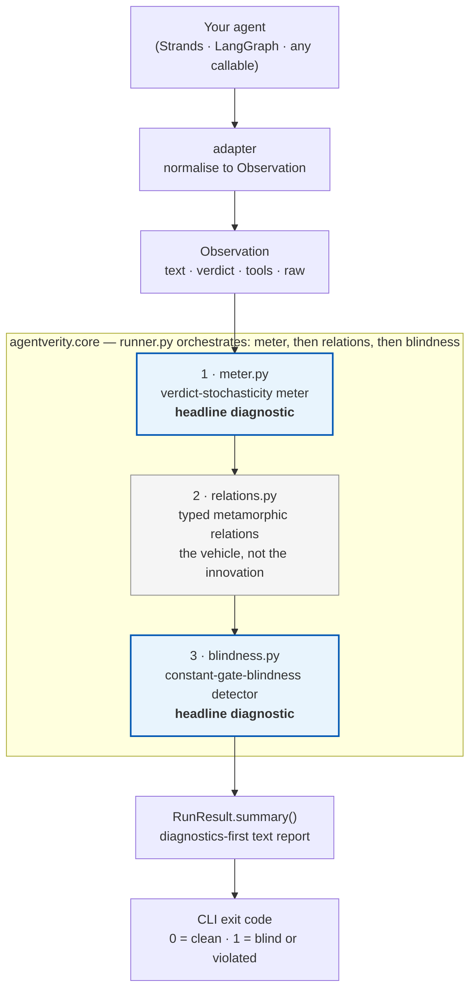

# agentverity

> **Does your agent test suite actually test anything, or is it lying to you?**

[](https://www.python.org/downloads/)
[](LICENSE)
[](#tests)
[](#status)

**agentverity** is a measure-first testing framework for non-deterministic LLM agents. Before running any test relation, it answers two questions no other tool asks:

1. **Is the agent's verdict stable enough to test against?** (verdict-stochasticity meter)
2. **Is the test suite trivially satisfied by an indifferent agent?** (constant-gate-blindness detector)

If either diagnostic says "no," agentverity tells you that metamorphic relations are the wrong tool — instead of wasting your effort and giving you false confidence.

---

## Why does this exist?

Testing LLM agents is hard because they are non-deterministic: the same input can produce different outputs on different runs. Existing frameworks handle this by running the agent N times and reporting pass rates with confidence intervals. That is necessary but not sufficient. It misses two failure modes:

**Failure mode 1: the verdict is deterministic but you are using stochastic tests.** If the agent's categorical decision (allow/block, safe/unsafe, tool A/tool B) never flips across reruns, then a frozen-output diff is the strongest possible oracle. Metamorphic relations add nothing — they are a strict subset of what output-diffing already catches. Running them anyway wastes effort and can produce false violations from token-level noise.

**Failure mode 2: the agent is near-constant and your suite passes trivially.** If the agent returns the same verdict on 96% of a diverse input set, every invariance and monotone relation is satisfied automatically — not because the agent reasons correctly, but because the transform cannot move a verdict that never moves. A green suite is lying to you.

agentverity detects both failure modes *before* running any test relation, and tells you which oracle to use.

---

## How is this different from existing tools?

| | [DeepEval](https://github.com/confident-ai/deepeval) | [promptfoo](https://github.com/promptfoo/promptfoo) | [CheckList](https://github.com/marcotcr/checklist) | [AgentAssay](https://arxiv.org/abs/2603.02601) | [agentrial](https://github.com/alepot55/agentrial) | **agentverity** |
|---|---|---|---|---|---|---|
| Stars | 16.7k | 22.9k | 2k | paper | 17 | — |
| Non-determinism | No | No | Assumes deterministic | Yes (Wilson CIs) | Yes (Wilson CIs) | **Yes + measure-first** |
| Metamorphic relations | No | No | INV/DIR (owns it) | Yes | No | Yes (inherited) |
| Suite-quality diagnostic | No | Red-team coverage | No | Mutation testing | No | **Meter + blindness** |
| License | Apache-2.0 | MIT | MIT | AGPL | MIT | **Apache-2.0** |

**What we borrowed (and from where):**
- Metamorphic relations from [Chen et al. (1998)](https://arxiv.org/abs/2002.12543) and the [CheckList](https://aclanthology.org/2020.acl-main.442/)/[LLMORPH](https://github.com/steven-b-cho/llmorph) tradition — the escape from the oracle problem for non-deterministic systems.
- Semantic-invariance transforms (paraphrase, casing, whitespace) from [CheckList](https://github.com/marcotcr/checklist).
- [Wilson confidence intervals](https://en.wikipedia.org/wiki/Binomial_proportion_confidence_interval#Wilson_score_interval) from [AgentAssay](https://arxiv.org/abs/2603.02601) and [agentrial](https://github.com/alepot55/agentrial) — but we use them for a different purpose: certifying verdict stability across reruns, not pass-rate CIs.

**What is genuinely new (the three differentiators, confirmed by scanning every tool above):**

1. **Measure-first verdict-stochasticity meter.** No tool asks "is the verdict even stochastic before applying MRs?" AgentAssay assumes non-determinism throughout. agentrial runs N trials and reports CIs but never says "your verdict is deterministic — stop using MRs." agentverity runs the meter first and tells you which oracle to use.

2. **Constant-gate-blindness detector.** No tool detects when a passing suite is trivially satisfied by a near-constant agent. A gate that returns `"allow"` on 96% of inputs satisfies every invariance relation trivially. agentverity measures the verdict skew and flags it before you trust a green report.

3. **Suite-quality diagnostic framing.** DeepEval, promptfoo, and agentrial run tests and report pass/fail. AgentAssay runs mutation testing on the suite. agentverity is the only tool whose primary output is "is this suite meaningful?" — the diagnostics come first, the relation results second.

Metamorphic relations are the vehicle. The diagnostics are the product.

---

## Quickstart

### Install

Not yet on PyPI (see [Status](#status)). Install from GitHub:

```bash
pip install git+https://github.com/mrwersa/agentverity.git
```

For Strands agent support:

```bash
pip install "agentverity[strands] @ git+https://github.com/mrwersa/agentverity.git"
```

### Use in Python

```python
from agentverity import run, from_callable

def my_gate(text: str) -> dict:
    verdict = "block" if "secret" in text.lower() else "allow"
    return {"text": f"decision: {verdict}", "verdict": verdict}

agent = from_callable(my_gate)
result = run(agent, inputs=["hello", "a secret", "world", "foo"])
print(result.summary())
```

Output (captured from an actual run, not hand-written):

```
============================================================
agentverity — suite-quality report
============================================================

1. VERDICT-STOCHASTICITY METER
   call:        undecided (add repeats or inputs)
   flip rate:   0.0% (0/40 pairs)
   Wilson CI:   [0.000, 0.088] at epsilon=0.01
   inputs:      4, repeats: 5, layer: verdict
   advice:      not enough evidence to choose an oracle; raise K or input count.

2. CONSTANT-GATE-BLINDNESS DETECTOR
   call:        ok
   skew:        75.0% ('allow' on 4 inputs)
   distinct:    2 verdicts

3. SUITE MEANINGFUL?
   UNDECIDED — raise k or input count to resolve the meter.

4. RELATION RESULTS
   relation                       type           held   violated     rate
   ------------------------------ ------------ ------ ---------- --------
   paraphrase-invariance          invariant         4          0    0.0%
   case-invariance                invariant         4          0    0.0%
   whitespace-invariance          invariant         4          0    0.0%
   tool-selection-invariance      invariant         4          0    0.0%
```

Notice the meter says `undecided`, not `verdict-deterministic`, even though `my_gate` is a plain Python function with zero randomness. That's deliberate: 4 inputs at 5 repeats is 40 pairwise comparisons, not enough for the Wilson interval to clear the default 1% epsilon. A bare `deterministic` label here would be indistinguishable from real stability, so the meter says `undecided` and tells you to raise `k` or add inputs instead of guessing. Bump `k` to 20 (or add more inputs) on a real agent and a genuinely stable verdict will resolve to `verdict-deterministic`.

### CLI

```bash
agentverity run --agent mymod:build_agent --inputs seeds.txt
```

The `--agent` argument is a Python dotted path `module:func` to a callable that returns an agent function. The `--inputs` argument is a text file with one input per line.

Exit codes: `0` if all relations hold and no blindness is detected. `1` if the gate is blind or any relation is violated.

### Strands adapter

```python
from strands import Agent
from agentverity.adapters.strands import from_strands
from agentverity import run

strands_agent = Agent(model="...", system_prompt="you are a gate")
agent = from_strands(strands_agent)
result = run(agent, inputs=["should I share this?", "is this safe?"])
print(result.summary())
```

The Strands adapter extracts the final response text, structured-output verdict (if any), and the ordered tool-call sequence from the agent's message content blocks. The adapter is an optional import — the core installs without `strands-agents`.

### Custom relations

```python
from agentverity import run, from_callable, Relation

my_relation = Relation(
    name="escalation-monotone",
    rtype="monotone",
    transform=lambda s: s + " URGENT",
    check=lambda src, fol: src.verdict <= fol.verdict if src.verdict and fol.verdict else True,
)

result = run(agent, inputs=my_inputs, relations=[my_relation])
```

Relations are typed `INVARIANT`, `MONOTONE`, or `DIRECTIONAL` because on a non-deterministic agent the types have different noise robustness: monotone and directional are robust to verdict noise, invariance is fragile. The runner leads with the robust ones on stochastic agents.

---

## API surface

```python
from agentverity import (
    run,                # main entry: run(agent, inputs, relations=..., config=...) -> RunResult
    from_callable,      # adapter: wrap fn(input)->str|dict|Observation
    measure,            # meter only: measure(agent, inputs, k=5, ...) -> MeterResult
    detect,             # blindness only: detect(agent, inputs, threshold=0.9) -> BlindnessResult
    Observation,        # dataclass: text, verdict, tools, raw
    Relation,           # dataclass: name, rtype, transform, check
    builtin_relations, # paraphrase, case, whitespace, tool-selection
    RunConfig,          # k, epsilon, blindness_threshold, layer, run_meter, run_blindness
)

from agentverity.adapters.strands import from_strands  # optional, needs strands-agents
```

### `RunResult`

The return of `run()` carries the full diagnostic picture:

| Property | Type | Description |
|---|---|---|
| `result.meter` | `MeterResult \| None` | Verdict-stochasticity meter result |
| `result.blindness` | `BlindnessResult \| None` | Constant-gate-blindness result |
| `result.relation_results` | `list[RelationResult]` | Per-relation held/violated counts |
| `result.is_stochastic` | `bool` | True if meter says verdict-stochastic |
| `result.is_blind` | `bool` | True if blindness detector fires |
| `result.suite_is_meaningful` | `bool` | False if blind or deterministic or undecided |
| `result.summary()` | `str` | Human-readable report, diagnostics-first |

### `MeterResult`

| Property | Description |
|---|---|
| `.flip_rate` | Observed pairwise flip rate |
| `.ci_low`, `.ci_high` | Wilson CI bounds |
| `.call` | `"verdict-stochastic"` / `"verdict-deterministic"` / `"undecided"` |
| `.advice` | Human-readable recommendation |

---

## Architecture



`cli.py` wraps this same flow behind `agentverity run --agent module:func --inputs file.txt`.

### Three layers of `Observation`

Every agent call produces an `Observation` with four fields:

| Field | Description |
|---|---|
| `text` | The agent's final response string (always present) |
| `verdict` | An optional extracted categorical decision (`"allow"`/`"block"`, `"safe"`/`"unsafe"`) |
| `tools` | The ordered tool names the agent called (its trajectory) |
| `raw` | The underlying result object, for custom relations |

The meter and relations can assert on any layer: `verdict` (default), `text`, or `tools`. This lets you measure stochasticity at the layer that matters — the verdict level, not the token level.

---

## Built-in relations

| Name | Type | What it checks |
|---|---|---|
| `paraphrase-invariance` | invariant | Accent stripping and whitespace normalisation must not change the verdict |
| `case-invariance` | invariant | Inverting letter case must not change the verdict |
| `whitespace-invariance` | invariant | Leading newline and trailing spaces must not change the verdict |
| `tool-selection-invariance` | invariant | Paraphrasing the request must not change which tool the agent calls |

The first three are inherited from the CheckList/LLMORPH tradition and apply to any text-in/text-out system. The fourth is agent-native: it asserts over the tool trajectory, not the text, and is the relation that makes agentverity an agent framework rather than an NLP model framework.

---

## How it works

### 1. Meter (headline #1)

The meter calls the agent `k` times on each unchanged input and counts pairwise verdict flips. A Wilson confidence interval on the flip rate determines a tri-state call:

- **`verdict-stochastic`** — the CI lower bound is above epsilon. The verdict varies. Use noise-robust relations and compare violations to a measured baseline, not zero.
- **`verdict-deterministic`** — the CI upper bound is below epsilon. The verdict is stable. A frozen-output diff is the strongest oracle. MRs add little.
- **`undecided`** — the interval straddles epsilon. Not enough evidence. Raise `k` or input count.

The meter refuses to call an underpowered probe "deterministic" — a bare `deterministic` would conflate real stability with a too-small sample.

### 2. Blindness detector (headline #2)

The detector calls the agent once on each input and measures the verdict distribution. If a single verdict accounts for more than `threshold` (default 90%) of inputs, the gate is flagged as blind: every relation is trivially satisfied because the transform cannot move a verdict that never moves.

### 3. Relations (the vehicle)

Relations run source and follow-up inputs through the agent and check whether a structural law holds between the two outputs. On a stochastic agent the runner compares violation rates against a measured baseline rather than zero tolerance, because invariance relations are noise-fragile while monotone/directional relations are robust.

---

## Tests

61 tests, all passing.

```bash
pip install -e ".[dev]"
python -m pytest tests/ -v
ruff check .
```

Coverage: observation construction and frozenness, Wilson CI bounds and edge cases, meter detection (deterministic/stochastic/layer/k-guard), blindness detection (constant/balanced/near-constant/custom threshold), all transforms and relation checks, runner orchestration (deterministic/stochastic/blind/config/summary), callable adapter (str/dict/custom-keys/passthrough/other), Strands adapter (text/tool/structured-output/no-message/empty), CLI (run/exit-codes/bad-spec).

---

## Status

Alpha. Core API is stable. Strands adapter is verified. LangGraph adapter is planned. Not yet on PyPI.

## License

[Apache-2.0](LICENSE)
