# AgentKit evidence: tool selection across three models

4,380 real model calls against the tool set a published agent exposes, to ask
one question: given the same request twice, does a model pick the same tool?

Everything here re-runs. The evidence files hold the individual observations,
so `summarise.py` and `agentverity assess` cost nothing.

## What was measured, and what was not

The target is the tool set of the
[Coinbase AgentKit](https://github.com/coinbase/agentkit) Strands example
chatbot: the twenty tools its seven wired providers declare, taken from
`coinbase-agentkit` 0.7.4 source. `agentkit_tools.json` holds the names and
descriptions exactly as AgentKit declares them.

**This is not AgentKit's chatbot end to end.** Constructing that needs CDP
credentials and a funded wallet, and executing the tools would move money. The
decision under test is tool *selection*, so the tools are declared to each
model exactly as AgentKit declares them and nothing is executed. The model
still makes the entire choice.

One turn, `tool_choice="required"`, temperature left at each provider's
default. Pinning it to zero would measure a configuration nobody deploys.

## Start here: the tool refuses to certify this evidence

Run the command this README recommends and the headline verdict is **NOT
TRUSTWORTHY**:

```console
$ agentverity assess --evidence evidence-gpt4o_mini.json --suite suite.json
  NOT TRUSTWORTHY - the declared decision contract is incomplete: required
  decisions were represented by cases but not returned: approve, fetch_price,
  get_balance, get_portfolio.
```

That is not a bug in the evidence. It is the contract check working, and one
line of it is worth understanding before anything else here.

`approve` was returned **98 times out of 146**. The contract still reports it
as never observed, because the contract reads the *first* verdict of each case
and the first answer to that probe was `get_erc20_token_address`. The route
table and the contract mean different things by "reached": the table counts
every repeat, the contract counts the opening answer.

So a route can be **stochastic but reached** in one section and **never
observed** in another, from the same evidence. That is a real wrinkle in this
library, surfaced by its own flagship example, and it is recorded in the
roadmap rather than tidied away here.

The other three are simpler: `fetch_price`, `get_balance` and `get_portfolio`
genuinely never came back, because these models answered those probes with a
different tool every time.

## The result

```
model                                           correct  always the same
amazon/nova-micro-v1                               4/10             1/10
openai/gpt-4o-mini                                 7/10             8/10
mistralai/mistral-small-3.2-24b-instruct           5/10            10/10
```

Read the two columns against each other. `mistral-small` returned the same
tool on every one of ten probes, 146 times each, and was correct on half of
them. It would pass a stability gate perfectly while being worse at the task
than `gpt-4o-mini`, which is unstable on two routes.

Repeatability is not correctness. This is that sentence with numbers behind
it.

## Where gpt-4o-mini is unstable, and why it matters

```
route              cases  pairs  flips  95% CI            result
approve                1     73     34  [0.356, 0.579]    stochastic
transfer               1     73     28  [0.281, 0.498]    stochastic
  approve <-> get_erc20_token_address  x34
  get_erc20_token_address <-> transfer x28
```

Eight routes settle as deterministic at a 5% tolerance. The two that do not
are `transfer` and `approve`, which are two of the three the suite marks
**critical** because they move value or grant the right to move it.

Neither alternative is silly. Asked to send USDC, the model sometimes calls
`transfer` and sometimes resolves the token address first. Both are reasonable
opening moves. What a release needs to know is that the first action on a
value-moving request is close to a coin flip, and a pooled figure of 8.5%
across all ten routes does not say which routes carry it.

## About the `correct` column

`expected` in `suite.json` is a reviewed judgement, and it assumes the right
first tool is the one that does the job. Several models instead resolve an
identifier first, which is a defensible plan rather than a mistake, and this
single-turn setup cannot express it. Read that column as agreement with one
reviewer's labels, not as ground truth.

The stability column does not depend on those labels at all. A model that
answers `get_erc20_token_address` 146 times out of 146 is stable whatever
anybody thinks the right answer was.

## Two things the collection itself found

`tool_choice="required"` did not always produce a tool call. Nova Micro
answered with prose on **eight of ten probes**, and on two of them it was the
most common answer: 80 of 146 on `unwrap_eth`, 70 of 146 on
`request_faucet_funds`. The adapter records that as `no_tool_selected` rather
than leaving the verdict unset. Leaving it unset
makes the meter fall back to comparing raw text, so two differently worded
refusals count as a changed decision. That measures wording, not choice.

Two providers declare `get_balance`: `ERC20ActionProvider` and
`WalletActionProvider`. A tool-calling API cannot carry the same name twice,
so the first declaration wins here and the collision is recorded rather than
silently resolved.

## Re-running

Free, from the committed evidence:

```bash
python docs/evidence/agentkit/summarise.py
agentverity assess --evidence docs/evidence/agentkit/evidence-gpt4o_mini.json \
                   --suite docs/evidence/agentkit/suite.json
```

Collecting again costs 0.70 USD and about 30 minutes of wall time across the
three models, and needs an `OPENROUTER_API_KEY`:

```bash
agentverity plan --suite suite.json          # price it first: 1460 calls per model
python collect.py --factory gpt4o_mini --model openai/gpt-4o-mini \
                  --repeats 146 --out evidence-gpt4o_mini.json
```

Six workers is the default, which is what produced these files and the 30
minutes quoted above. Raising it shortens the wall clock and increases the
chance of an upstream rate limit, which the adapter retries rather than
records. Later runs write `workers` into provenance; the committed files
predate that field and used six.

Collected 2026-08-01 through OpenRouter. Model behaviour changes without
notice, so a later run reproducing the method is expected; a later run
reproducing these exact numbers is not.

## The other half

The same agent was measured for *authority* as well as stability:
[what it is permitted to do](https://github.com/mrwersa/agentmandate/tree/main/docs/evidence/agentkit).

Putting the two together finds something neither produces alone. `approve` is
the one tool whose permission outlives the run, because it grants an ERC-20
allowance another address can spend later. It is also the least stable route
here, at 34 flips in 73 pairs.



Regenerate the documentation SVG and the article PNG from `intersection.mmd`:

```bash
npx @mermaid-js/mermaid-cli -i docs/evidence/agentkit/intersection.mmd \
  -o docs/evidence/agentkit/intersection.svg -b white
npx @mermaid-js/mermaid-cli -i docs/evidence/agentkit/intersection.mmd \
  -o docs/evidence/agentkit/intersection.png -w 1200 -b white
```
