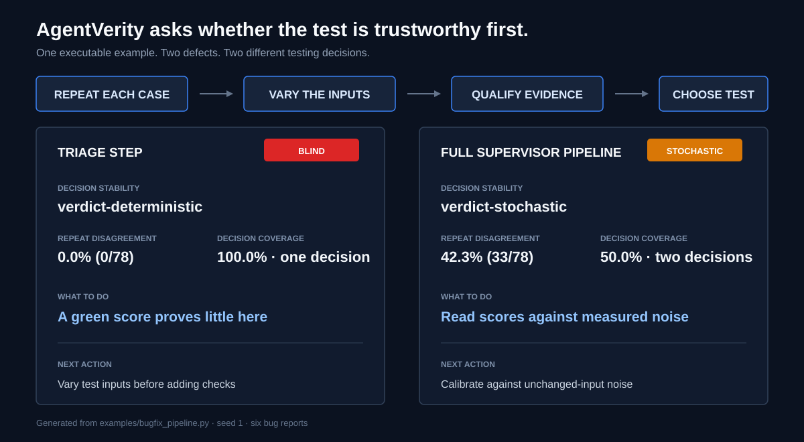

# Integrations

AgentVerity runs controlled test inputs beside quality evaluators. It does not
sit inside the customer request path.

```text
reviewed inputs ---> evaluation harness ---> repeated agent outputs
                                                |             |
                                  correctness / trajectory   AgentVerity
                                        quality result       admission
                                                |             |
                                                +----> release policy
                                                         |
                                                 admit or refuse baseline

customer request ----------> deployed agent ----------> response
```

## Recommended test and release pipeline

No single evaluator qualifies an agent. Use layers:

1. Define allowed decisions, required routes, critical labels, tool schemas,
   approval boundaries, and measurable success criteria.
2. Test deterministic orchestration, authorisation, schemas, idempotency, and
   tools with ordinary unit and integration tests.
3. Run reviewed cases through a quality evaluator for final answers, routes,
   tool selection, arguments, and task completion.
4. Test important agent steps separately, then the end-to-end tool or handoff
   path.
5. Stop on failed quality. When quality passes, run AgentVerity with the
   declared decision suite before saving a regression baseline.
6. Red-team prompt injection, data leakage, unsafe agency, tenant isolation,
   and exhausted step or cost budgets.
7. Combine quality, AgentVerity, security, latency, cost, and operational
   health in one release policy.
8. Use shadow traffic or a synthetic canary, trace the deployed workflow, and
   feed reviewed incidents back into the test dataset.

AgentVerity owns step 5. It does not replace the surrounding quality, security,
or operational checks. Running the cheaper labelled quality check first also
avoids spending on repeated calls for an agent already known to be wrong.
When the evaluator already retained repeated categorical outputs, import them
instead of making the target calls again. Promptfoo has a direct JSON bridge,
and DeepEval can share precomputed test cases. See
[imported evidence](imported-evidence.md).

One AWS-oriented stack might use
[`pytest`](https://docs.pytest.org/en/stable/how-to/parametrize.html) for
deterministic contracts,
[DeepEval](https://deepeval.com/docs/evaluation-unit-testing-in-ci-cd) for
labelled quality, AgentVerity for evidence qualification,
[promptfoo](https://www.promptfoo.dev/docs/red-team/quickstart/) for
adversarial probes,
[AgentCore Evaluations](https://docs.aws.amazon.com/bedrock-agentcore/latest/devguide/evaluations-types.html)
for managed assessment, and
[OpenTelemetry](https://opentelemetry.io/docs/what-is-opentelemetry/) plus
[CloudWatch](https://docs.aws.amazon.com/AmazonCloudWatch/latest/monitoring/AgentCore-GettingStarted.html)
for operations. These are replaceable components. Keep datasets, decision
contracts, and release policy outside one vendor dashboard.

## Connect an agent

| Stack | Connection |
|---|---|
| Plain Python | Wrap `fn(str) -> str | dict | Observation` with `from_callable` |
| Strands Agents | Use `from_strands_factory` for isolated trials |
| LangGraph | Wrap `graph.invoke` and return an `Observation` |
| Remote agent | Wrap the SDK or HTTP call and extract the decision or tool path |
| AgentCore Runtime | Wrap `invoke_agent_runtime` and start a fresh session per trial |

Choose the observation layer that owns the contract:

- `Observation.verdict` for a route, approval, or policy decision
- `Observation.tools` for an ordered tool or agent path
- `Observation.text` for a final response

Strands agents retain conversation history. Repeated trials need equivalent
starting context, so use a factory:

```python
from agentverity.adapters.strands import from_strands_factory

agent = from_strands_factory(build_fresh_agent)
```

The factory can reuse a stateless model client, but it must create a fresh
agent session.

## Test a multi-agent system

Wrap the scope that owns the decision:

- **System level:** test the final pipeline decision.
- **Step level:** test one agent or handoff independently.

For a critical path, run both. The bundled
[`bugfix_pipeline.py`](../examples/bugfix_pipeline.py) finds a stable but
single-path triage step inside a supervisor whose final decision varies.
One end-to-end score hides that difference.



Use `Observation.tools` or `layer="tools"` when the handoff sequence matters.
A pipeline can preserve its final decision while changing which component acts.

## Send the result to CI

JUnit reaches the report surface a team already uses:

```bash
agentverity run \
  --agent examples/payment_dispute_gate.py:build_agent \
  --suite examples/payment_decisions.json \
  --format junit \
  --output agentverity.xml
```

Exit codes and JUnit share one interpretation:

| Code | Meaning |
|---:|---|
| 0 | Evidence is interpretable and no requested relation failed |
| 1 | Poor or incomplete declared coverage, an ineffective or failed relation, or snapshot drift |
| 2 | Incomplete, undecided, or unsupported evidence |

An unstable decision changes the test strategy. It does not by itself prove
that the agent is defective.

## Send the result to observability

Install the optional bridge:

```bash
pip install "agentverity[otel]"
```

```python
from agentverity import record_otel_run

result = run(agent, inputs=canary_inputs)
record_otel_run(result)
```

The span contains low-cardinality `agentverity.*` attributes. It excludes raw
prompts, outputs, fingerprints, relation names, and exception messages. The
host application's OpenTelemetry configuration can send it to CloudWatch,
Phoenix, LangSmith, or any OTLP collector.

Do not repeat live customer requests. Run a reviewed synthetic set in CI,
before deployment, or on a schedule, then monitor the aggregate result.

Budget remote calls first. Six cases at `cheap` precision plan 78 calls.
Twenty plan 100 because evidence is shared across the set. At `balanced`
precision, twenty cases plan 180 calls. The CLI prints the plan before running.

## Run the production example

[`examples/production_stack/`](../examples/production_stack/) combines:

- a Strands payment-dispute router on Amazon Bedrock
- DeepEval exact match against six reviewed labels
- AgentVerity stability, coverage, and snapshot admission
- AgentCore Runtime with fresh sessions for repeated trials
- JUnit, OpenTelemetry, and CloudWatch handoffs

DeepEval answers whether the routes are correct. AgentVerity answers whether
that score is repeatable and covers the reviewed decision set. Release policy
requires both.

At its declared 10% tolerance, the measured London canary produced 6/6 correct
routes, no changes across 36 repeat pairs, six routes reached, 78 successful
invocations, and no errors or throttles. An earlier run was stable and well
covered but scored only 5/6. The example now stops before snapshot admission
when quality fails.

See the [method and redacted result](../examples/production_stack/RESULTS.md).
No account identifiers, runtime ARNs, prompts, outputs, sessions, or trace
identifiers are committed.

Useful references:

- [DeepEval CI/CD testing](https://deepeval.com/docs/evaluation-unit-testing-in-ci-cd)
- [AgentCore Observability](https://docs.aws.amazon.com/bedrock-agentcore/latest/devguide/observability.html)
- [Phoenix OTLP tracing](https://arize.com/docs/phoenix/tracing/concepts-tracing/how-does-tracing-work)
- [LangSmith OpenTelemetry tracing](https://docs.langchain.com/langsmith/trace-with-opentelemetry)
